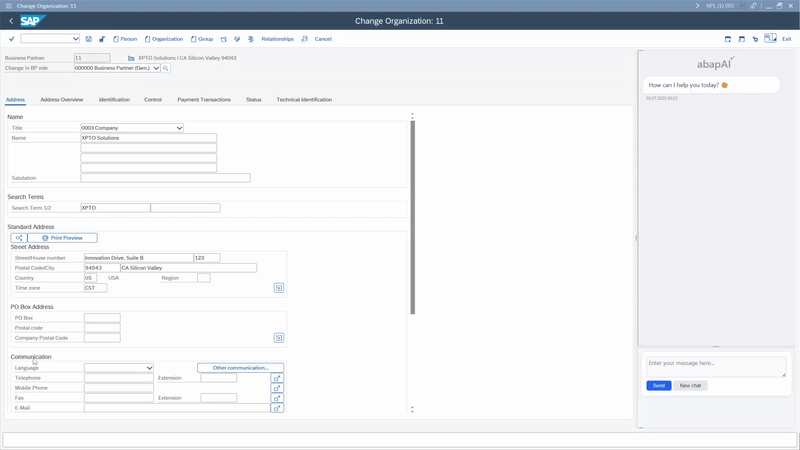
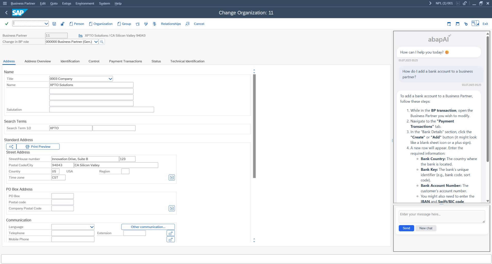
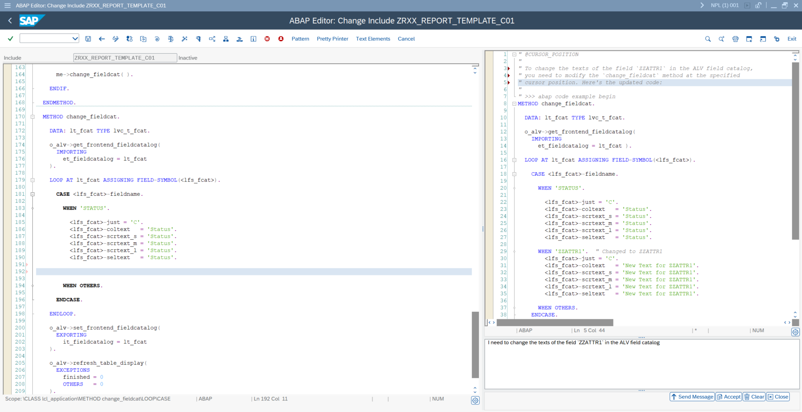

# yaai_ui - ABAP AI User Interface
This repository contains the user interface components for the `ABAP AI Tools`, designed to enhance interaction with the core functionalities.

**See it in Action** 😊



## Installation
You can install the `ABAP AI User Interface` into your SAP system using `abapGit`. Follow the steps below:

## Prerequisites
 - **ABAP AI Tools**: The `ABAP AI Tools` (https://github.com/christianjianelli/yaai) must be installed in your SAP system before proceeding with the UI installation.
 - **abapGit**: Ensure that `abapGit` is installed and configured in your ABAP system. If not, you can find the latest version and installation instructions on the official abapGit website: https://docs.abapgit.org/
 - **Developer Access**: You need appropriate developer authorizations in your ABAP system to import objects.

## Installation Steps

 1 - **Open abapGit**: In your SAP GUI, execute transaction `ZABAPGIT` (or the equivalent transaction code you have set up for abapGit).

 2 - **Add Online Repository**:
   - Click on the `+` button (Add Online Repo) or select "New Online" from the menu.

 3 - **Enter Repository URL**:
   - In the "URL" field, paste the URL of this GitHub repository: `https://github.com/christianjianelli/yaai_ui`
   - For the **Package**, we recommend creating a new package called `YAAI_UI`. Remember to assign it to a transport request if necessary.
   - Click "OK" or press Enter.

 4 - **Clone Repository**:
   - `abapGit` will display the repository details. Review the objects that will be imported.
   - Click the "Clone" button (often represented by a green download icon).

 5 - **Activate Objects**:
   - Once the cloning process is complete, `abapGit` will list the imported objects.
   - Activate any inactive objects if prompted.

 6 - **Verify Installation**:
   - After activation, all the `ABAP AI User Interface` objects (classes, programs, etc.) will be available in your specified package. You can verify this by checking transaction `SE80` for the package you used.

You have now successfully installed the `ABAP AI User Interface!`

## User Interface Components

Explore these components to enhance your workflow with ABAP AI Tools.

- **Chat Interface**: Engage in conversational AI interactions directly within your SAP system.

    [](docs/images/abap_ai_ui_chat.png)

  <br>

- **Code Assistant**: Access AI-powered code suggestions and assistance for ABAP development.

    [](docs/images/yaai_ui_code_assist.png)


## Quickstart

### Running Your First ABAP AI Chat

This quickstart example demonstrates how to launch a simple AI-powered chat interface in ABAP using the `yaai_ui` library. 
The provided code sets up a basic report that initializes the chat UI, connects to an AI model (such as OpenAI's GPT), and displays a user-friendly chat window. 
Make sure your API credentials and endpoints are configured before running the example.

```abap
REPORT yaai_ui_r_quickstart_chat.

PARAMETERS: p_model TYPE c LENGTH 30 LOWER CASE OBLIGATORY DEFAULT 'gpt-4.1'.

CLASS lcl_app DEFINITION.

  PUBLIC SECTION.

    DATA mo_aai_ui_chat TYPE REF TO ycl_aai_ui_chat_v2 READ-ONLY.

    METHODS run.

ENDCLASS.

CLASS lcl_app IMPLEMENTATION.

  METHOD run.

    IF me->mo_aai_ui_chat IS BOUND.
      "Avoid multiple instantiation
      RETURN.
    ENDIF.

    "This example assumes that the API base URL and the API Key are properly configured
    DATA(lo_aai_openai) = NEW ycl_aai_openai( i_model = p_model ).

    "Create a Chat instance passing the AI API you want to use 
    me->mo_aai_ui_chat = NEW #( io_api = lo_aai_openai
                                i_greeting = 'How can I help you today? 😊' ).

    "Display the Chat User Interface
    me->mo_aai_ui_chat->run( ).

  ENDMETHOD.

ENDCLASS.

DATA o_app TYPE REF TO lcl_app.

INITIALIZATION.

  "Set text for the selection screen fields
  %_p_model_%_app_%-text = 'Model'.

  o_app = NEW lcl_app( ).

AT SELECTION-SCREEN OUTPUT.

  o_app->run( ).
```

## Read the documentation

  - [ABAP AI User Interface Documentation](docs/README.md)