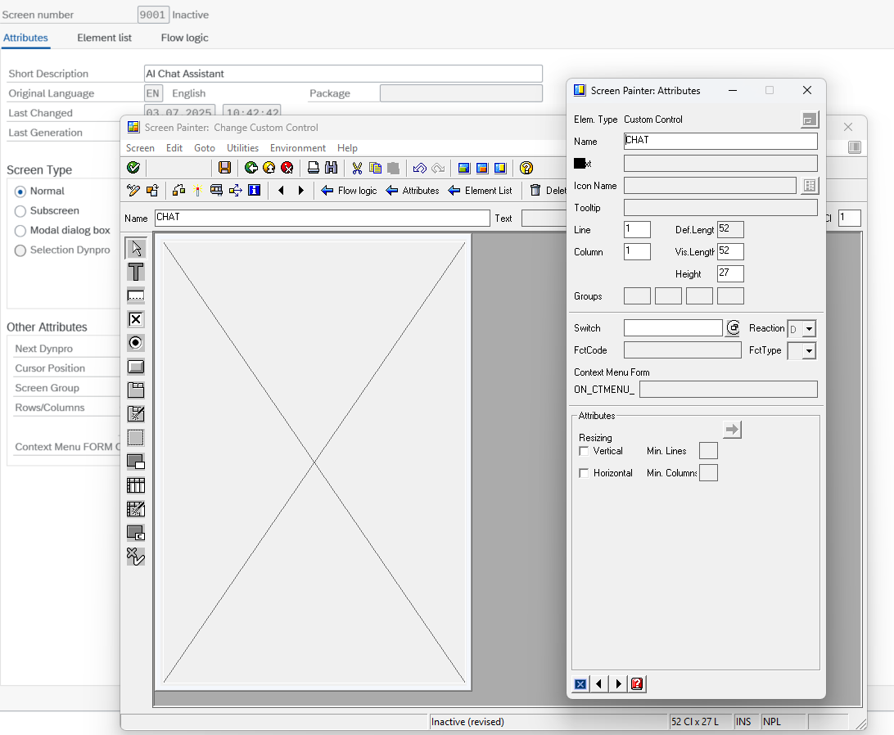

# yaai_ui - ABAP AI User Interface - Chat

The `yaai_ui` Chat component provides an interactive conversational interface for ABAP systems, enabling seamless integration with generative AI models (LLMs) and advanced features such as Retrieval Augmented Generation (RAG). This component is designed for SAP GUI environments and supports flexible UI embedding.

---

## Overview

The Chat UI allows users to interact with AI models in a familiar chat format. It supports:

- Multiple UI container modes (Docking, Dialog, Custom)
- Integration with any ABAP AI API implementing the interface `yif_aai_chat`
- Basic customization of appearance and behavior (with additional options likely to be introduced in future versions).
- Advanced AI functionality, including Retrieval-Augmented Generation (RAG), Prompt Templates, and Function Calling, enabled by `ABAP AI Tools` (https://github.com/christianjianelli/yaai)

---

## Instantiation

There are two main classes for chat UI:

- **`ycl_aai_ui_chat_v2`**: Recommended. Uses only HTML Viewer controls for a modern, responsive experience.
- **`ycl_aai_ui_chat`**: Version using TextEdit and Toolbar controls.

### Supported Modes

- **Docking Container** (default): Chat appears docked to the SAP GUI.
- **DialogBox Container**: Chat appears in a popup dialog.
- **Custom Container**: Embed chat in a developer-defined container (see Advanced Features).

### Basic Example

```abap
DATA(o_api) = NEW ycl_aai_openai( ).

DATA(o_chat) = NEW ycl_aai_ui_chat_v2(
  i_greeting     = 'Hello! How can I help you today?'
  io_api         = o_api
  i_display_mode = ycl_aai_ui_chat=>mc_display_mode_dock "the other options are: mc_display_mode_dialog, mc_display_mode_custom
).

o_chat->run( ).
```

---

## Customization

- **Logo**: Change or hide the chat logo.
- **Dialog Size**: Set popup width and height.
- **Input Length**: Limit maximum user input length.

```abap
o_chat->set_logo( i_logo = 'https://mydomain.com/mylogo.svg' ).

o_chat->hide_logo( ).

o_chat->set_popup_size( i_height = 500 i_width = 600 ).

o_chat->set_max_length( 500 ).
```

---

## Advanced Features

### 1. Custom Containers

To embed the chat in a custom SAP GUI container:

1. Create a screen with a custom container element.

    [](images/abap_screen_painter_custom_container.png)

2. Create an instance of the class `CL_GUI_CUSTOM_CONTAINER` and pass it in the Chat constructor.

    ```abap
    DATA o_custom_container TYPE REF TO cl_gui_custom_container.

    CREATE OBJECT o_custom_container
      EXPORTING
        container_name              = 'CHAT'
        EXCEPTIONS
        cntl_error                  = 1
        cntl_system_error           = 2
        create_error                = 3
        lifetime_error              = 4
        lifetime_dynpro_dynpro_link = 5
        OTHERS                      = 6.

    IF sy-subrc <> 0.
      "Handle error
    ENDIF.

    DATA(o_chat) = NEW ycl_aai_ui_chat_v2(
    io_api              = o_api
    io_custom_container = o_custom_container
    ).

    o_chat->run( ).
    ```

---

### 2. Retrieval Augmented Generation (RAG)

**RAG** enhances LLM responses by retrieving relevant context from external sources (e.g., vector databases) and injecting it into the prompt. This enables the AI to answer questions with up-to-date or domain-specific knowledge.

#### How it works

1. **User Prompt**: The user's question is received.
2. **Context Retrieval**: The RAG component searches a vector database for relevant documents or facts.
3. **Prompt Augmentation**: The retrieved context is combined with the user's prompt using a prompt template.
4. **LLM Response**: The augmented prompt is sent to the LLM for a more accurate answer.

#### Implementation

To enable RAG, implement the `yif_aai_rag` interface:

```abap
CLASS zcl_my_rag DEFINITION
  PUBLIC
  FINAL
  CREATE PUBLIC.
  PUBLIC SECTION.
    INTERFACES yif_aai_rag.
ENDCLASS.

CLASS zcl_my_rag IMPLEMENTATION.
  METHOD yif_aai_rag~augment_prompt.
    " Retrieve context from vector DB and augment prompt
    e_augmented_prompt = |Context: { retrieved_context } | && i_prompt.
  ENDMETHOD.
ENDCLASS.
```

Then, inject your RAG implementation:

```abap
lo_chat->set_rag( io_rag = NEW zcl_my_rag( ) ).
```