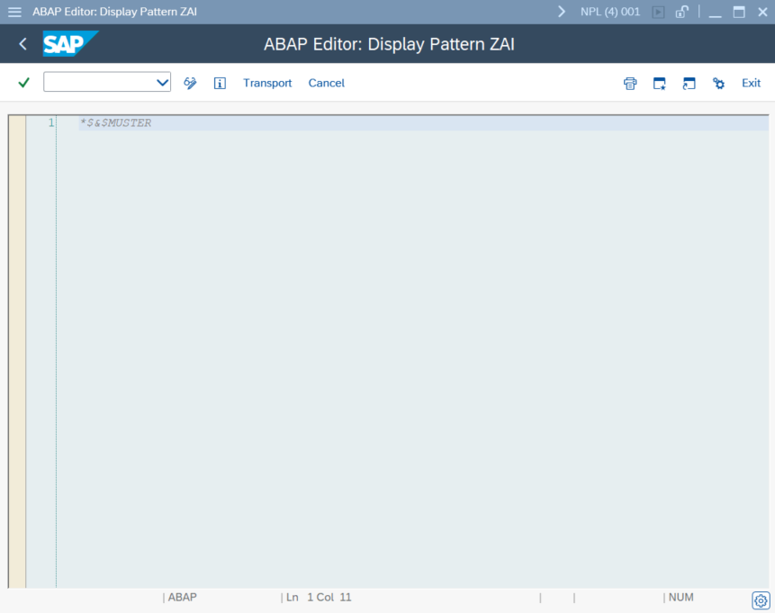

# yaai_ui - ABAP AI User Interface - Code Assistant

The ABAP AI Code Assistant is a chat tool designed specifically to help ABAP developers using ABAP Workbench Tools to write ABAP code.
It can be integrated into the ABAP Editor (SE38) and the Class Builder (SE24) via the SAP Enhancement SEUED001 (transaction SMOD).

The `ABAP AI Code Assistant` has a built-in feature for context awareness, automatically supplying the LLM model with the code being edited, the developer’s question, and system instructions.

## System Setup

To use the ABAP AI Code Assistant within SE38 and SE24, you must activate the SAP Enhancement SEUED001.

This is done by creating a project in transaction CMOD and assigning the enhancement SEUED001 to it.

After activating the project, there are two main ways to open the ABAP AI Code Assistant:

1. **Menu Exit +PGE**: Using the menu exit, which calls the function `EXIT_SAPLLOCAL_EDT1_002`.

    
    <br>
    <br>

2. **Dynamic Pattern**: Creating a dynamic pattern using `*$&$MUSTER`. 
    - [SAP Help - FAQ - DYNAMIC PATTERN - Custom Create Pattern in ABAP Editor](https://help.sap.com/docs/SUPPORT_CONTENT/home/3361892114.html)
    - [PDF version - DYNAMIC PATTERN - Custom Create Pattern in ABAP Editor](pdf/dynamic_pattern.pdf)

    
    <br>
    <br>

For a detailed explanation on how to implement it, see the `Implementation Instructions` below.

---

## Instantiation

The main class for the ABAP AI Code Assistant is:

- **`ycl_aai_ui_code_assist`** 

### Supported Modes

- **Docking Container** (default): Code Assistant appears docked to the SAP GUI.
- **DialogBox Container**: Code Assistant appears in a popup dialog.
- **Custom Container**: Embed Code Assistant in a developer-defined container (see Advanced Features).

### Basic Example

```abap
DATA(o_api) = NEW ycl_aai_openai( ).

DATA(o_aai_ui_code_assist) = NEW ycl_aai_ui_code_assist(
  io_api         = o_api
  i_display_mode = ycl_aai_ui_code_assist=>mc_display_mode_dock "Other options: mc_display_mode_dialog, mc_display_mode_custom
).

o_aai_ui_code_assist->run( ).
```

---

## Customization

- **Dialog Size**: Set popup width and height.
- **Context Awareness On/Off**: Turn the ABAP Editor/Class Builder Integration On/Off. 
- **Context Length**: Limit maximum number of code lines added to the prompt.
- **Input Length**: Limit maximum user input length.
- **Custom Prompt Template**: Set a custom prompt template.

```abap
o_aai_ui_code_assist->set_popup_size( i_height = 500 i_width = 600 ).

"Turn context awareness On/Off 
o_aai_ui_code_assist->set_abap_editor_integ_on().
o_aai_ui_code_assist->set_abap_editor_integ_off().

"Limit code lines
o_aai_ui_code_assist->set_max_lines( 200 ).

"Limit user input 
o_aai_ui_code_assist->set_max_length( 500 ).

"Pass an instance of a class that implements the yif_aai_prompt_template interface
o_aai_ui_code_assist->set_prompt_template( o_custom_aai_prompt_template ).
```

---

## Implementation Instructions

### Opening the ABAP AI Code Assistant via Menu Exit +PGE

The following is a basic example of how to open the code assistant directly from the include `ZXSEUU25` (function `EXIT_SAPLLOCAL_EDT1_002`):

```abap
IF o_aai_ui_code_assist IS NOT BOUND.

  DATA(o_api) = NEW ycl_aai_openai( ).

  l_system_instructions = |You are an expert ABAP coding assistant.\nYour primary task is to help users analyze, optimize, and improve their ABAP code.\n|.
  l_system_instructions = |{ l_system_instructions } You will be provided with the user's current code and the specific line where their editor cursor is positioned,|.
  l_system_instructions = |{ l_system_instructions } identified by the string @CURSOR_POSITION.\nUse the cursor position to focus your immediate attention, |.
  l_system_instructions = |{ l_system_instructions } while considering the overall code for broader context.\nRespond in a clear, concise, and technically accurate manner.\n|.
  l_system_instructions = |{ l_system_instructions } Assume the user is an experienced ABAP developer; avoid explaining fundamental programming concepts.\n|.
  l_system_instructions = |{ l_system_instructions } When the user asks for code modifications or new code, provide the direct ABAP code solution.\n|.
  l_system_instructions = |{ l_system_instructions } If the user asks for analysis, explanation, or optimization advice, focus your response on that specific request.\n|.
  l_system_instructions = |{ l_system_instructions } Avoid providing extraneous examples of how to call the code (e.g., full program snippets for calling a method)|.
  l_system_instructions = |{ l_system_instructions } unless explicitly requested as part of the solution.\n|.
  l_system_instructions = |{ l_system_instructions } Any explanatory text must be an ABAP comment starting with double quotes.|.

  o_api->set_system_instructions( l_system_instructions ).

  o_aai_ui_code_assist = NEW #( io_api = o_api ).

ENDIF.

o_aai_ui_code_assist->run( ).
```

### Opening the ABAP AI Code Assistant via Dynamic Pattern

Implementing a dynamic pattern requires some additional development effort, and the developer responsible for the integration must perform several steps to ensure it functions correctly. The main steps are:

1. Create a function module that follows the naming conventions and parameter requirements for Dynamic Patterns.
2. Create a screen with a custom container within the same Function Group as your function module.
3. Create a GUI status for the screen that provides buttons, enabling the user to accept or reject the model’s response.  
4. The function module should call the screen as a dialog (popup) using `CALL SCREEN NNNN STARTING AT X Y`.
5. In the screen's PBO (Process Before Output), instantiate the ABAP AI Code Assistant and call its `RUN` method.
6. When the developer clicks the `Accept` button and exits the code assistant, ensure the code is passed to the BUFFER table.

  **Example**:

  Function Module

  ```abap
  FUNCTION ZAI_EDITOR_EXIT.
  *"----------------------------------------------------------------------
  *"*"Local Interface:
  *"  TABLES
  *"      BUFFER TYPE  RSWSOURCET
  *"  EXCEPTIONS
  *"      CANCELLED
  *"----------------------------------------------------------------------
    
    
    CALL SCREEN 9001 STARTING AT 2 2.

    "Declare o_aai_ui_code_assist as a global variable in the Top Include of the Function Group
    IF o_aai_ui_code_assist IS BOUND AND o_aai_ui_code_assist->m_code_accepted = abap_true.

      buffer[] = o_aai_ui_code_assist->mt_buffer[].

      RETURN.

    ENDIF.

    RAISE cancelled.

  ENDFUNCTION.
  ```

  Screen 9001 PBO

  ```abap
  CREATE OBJECT o_cc
      EXPORTING
        container_name              = 'CHAT'           " Name of the Screen CustCtrl Name to Link Container To
      EXCEPTIONS
        cntl_error                  = 1                " CNTL_ERROR
        cntl_system_error           = 2                " CNTL_SYSTEM_ERROR
        create_error                = 3                " CREATE_ERROR
        lifetime_error              = 4                " LIFETIME_ERROR
        lifetime_dynpro_dynpro_link = 5                " LIFETIME_DYNPRO_DYNPRO_LINK
        OTHERS                      = 6.

  IF sy-subrc <> 0.
    "Handle error
  ENDIF.

  "Instantiate the code assistant only once in the screen PBO
  IF o_aai_ui_code_assist IS NOT BOUND.

    "Declare o_aai_openai as a global variable in the Top Include of the Function Group
    o_aai_openai = NEW #( i_model = 'gpt-4.1' ).

    l_system_instructions = 'Define your system instructions ...'

    o_aai_openai->set_system_instructions( l_system_instructions ).

    o_aai_ui_code_assist = NEW #( io_api = o_aai_openai
                                  io_custom_container = o_cc ).

    o_aai_ui_code_assist->run( ).

  ENDIF.
  ``` 

  Screen 9001 PAI

  ```abap
    
    "If the user accepts the model’s response then set the code as accepted    
    o_aai_ui_code_assist->set_code_accepted( ).

    "Free the code assistant objects 
    o_aai_ui_code_assist->free( ).

    "Free the custom container
    o_cc->free(
      EXCEPTIONS
        cntl_error        = 0                " CNTL_ERROR
        cntl_system_error = 0                " CNTL_SYSTEM_ERROR
        OTHERS            = 0
    ).

    LEAVE TO SCREEN 0.

  ```

---

## Using the Code Assistant

Using the ABAP AI Code Assistant is simple:

1. **Enter your question** in the textedit control.
2. **Click the Send button** and wait for the model's response.
3. **Review the response** in the code editor area. You can:
   - Accept the response as-is.
   - Edit the suggested code directly in the assistant before accepting.
   - Reject the response and ask a new question or close the assistant.
4. **Accepting the response** will insert the code at your current cursor position in the ABAP editor.

Example:

[](images/yaai_ui_code_assist_using_1.png)

<br>

[](images/yaai_ui_code_assist_using_2.png)

<br>

[](images/yaai_ui_code_assist_using_3.png)

## Advanced Features

### 1. Custom Containers

To embed the ABAP AI Code Assistant in a custom SAP GUI container:

1. Create a screen with a custom container element.

    [](images/abap_screen_painter_custom_container.png)

2. Create an instance of the class `CL_GUI_CUSTOM_CONTAINER` and pass it to the code assistant constructor.

    ```abap
    DATA: o_custom_container    TYPE REF TO cl_gui_custom_container,
          o_aai_ui_code_assist TYPE REF TO ycl_aai_ui_code_assist.

    CREATE OBJECT o_custom_container
      EXPORTING
        container_name              = 'CHAT'
      EXCEPTIONS
        cntl_error                  = 1
        cntl_system_error           = 2
        create_error                = 3
        lifetime_error              = 4
        lifetime_dynpro_dynpro_link = 5
        OTHERS                      = 6.

    IF sy-subrc <> 0.
      "Handle error
    ENDIF.

    o_aai_ui_code_assist = NEW #( io_api = o_api
                                  io_custom_container = o_custom_container ).

    o_aai_ui_code_assist->run( ).
    ```

---

### 2. System Instructions

For code assistance, it is essential to provide clear instructions to the model so it can deliver useful and meaningful responses.

**Example**

```abap
  DATA(o_api) = NEW ycl_aai_openai( ).

  l_system_instructions = |You are an expert ABAP coding assistant.\nYour primary task is to help users analyze, optimize, and improve their ABAP code.\n|.
  l_system_instructions = |{ l_system_instructions } You will be provided with the user's current code and the specific line where their editor cursor is positioned,|.
  l_system_instructions = |{ l_system_instructions } identified by the string @CURSOR_POSITION.\nUse the cursor position to focus your immediate attention, |.
  l_system_instructions = |{ l_system_instructions } while considering the overall code for broader context.\nRespond in a clear, concise, and technically accurate manner.\n|.
  l_system_instructions = |{ l_system_instructions } Assume the user is an experienced ABAP developer; avoid explaining fundamental programming concepts.\n|.
  l_system_instructions = |{ l_system_instructions } When the user asks for code modifications or new code, provide the direct ABAP code solution.\n|.
  l_system_instructions = |{ l_system_instructions } If the user asks for analysis, explanation, or optimization advice, focus your response on that specific request.\n|.
  l_system_instructions = |{ l_system_instructions } Avoid providing extraneous examples of how to call the code (e.g., full program snippets for calling a method)|.
  l_system_instructions = |{ l_system_instructions } unless explicitly requested as part of the solution.\n|.
  l_system_instructions = |{ l_system_instructions } Any explanatory text must be an ABAP comment starting with double quotes.|.

  o_api->set_system_instructions( l_system_instructions ).
```

### 3. Retrieval Augmented Generation (RAG)

**RAG** enhances LLM responses by retrieving relevant context from external sources (e.g., vector databases) and injecting it into the prompt. This enables the AI to answer questions with up-to-date or domain-specific knowledge.

#### How it works

1. **User Prompt**: The user's question is received.
2. **Context Retrieval**: The RAG component searches a vector database for relevant documents or facts.
3. **Prompt Augmentation**: The retrieved context is combined with the user's prompt using a prompt template.
4. **LLM Response**: The augmented prompt is sent to the LLM for a more accurate answer.

For code assistance, it is essential to provide the current code to the LLM for context.
The ABAP AI Code Assistant can do this automatically, but you can also provide custom context if your use case requires it.