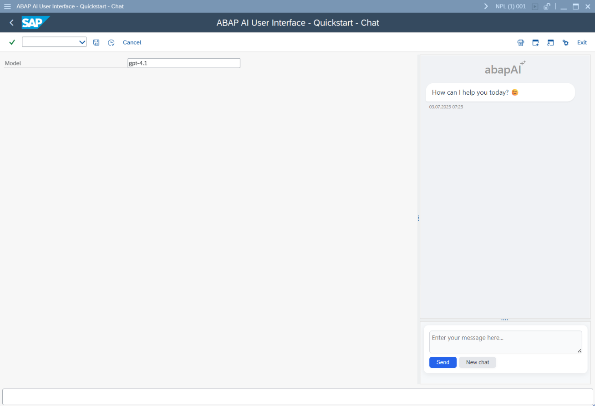
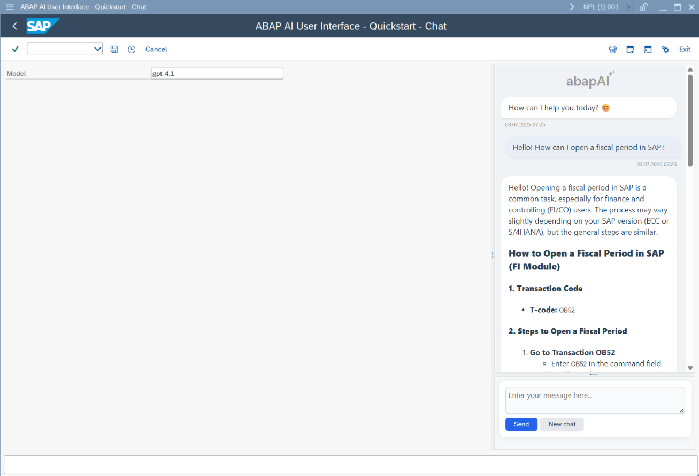

# yaai_ui - ABAP AI User Interface - Quickstart

## Running Your First ABAP AI Chat

This quickstart example demonstrates how to launch a simple AI-powered chat interface in ABAP using the `yaai_ui`. 
The provided code sets up a basic report that initializes the chat UI, connects to an AI model (such as OpenAI's GPT), and displays a user-friendly chat window. 

Make sure your API Key and the API base URL are configured before running the example.

```abap
REPORT yaai_ui_r_quickstart_chat.

PARAMETERS: p_model TYPE c LENGTH 30 LOWER CASE OBLIGATORY DEFAULT 'gpt-4.1'.

CLASS lcl_app DEFINITION.

  PUBLIC SECTION.

    DATA mo_aai_ui_chat TYPE REF TO ycl_aai_ui_chat_v2 READ-ONLY.

    METHODS run.

ENDCLASS.

CLASS lcl_app IMPLEMENTATION.

  METHOD run.

    IF me->mo_aai_ui_chat IS BOUND.
      "Avoid multiple instantiation
      RETURN.
    ENDIF.

    "This example assumes that the API base URL and the API Key are properly configured
    DATA(lo_aai_openai) = NEW ycl_aai_openai( i_model = p_model ).

    "Create a Chat instance passing the AI API you want to use 
    me->mo_aai_ui_chat = NEW #( io_api = lo_aai_openai
                                i_greeting = 'How can I help you today? 😊' ).

    "Display the Chat User Interface
    me->mo_aai_ui_chat->run( ).

  ENDMETHOD.

ENDCLASS.

DATA o_app TYPE REF TO lcl_app.

INITIALIZATION.

  "Set text for the selection screen fields
  %_p_model_%_app_%-text = 'Model'.

  o_app = NEW lcl_app( ).

AT SELECTION-SCREEN OUTPUT.

  o_app->run( ).
```

**Result:**

The following screenshots show the output you can expect after running the example report.



<br>

